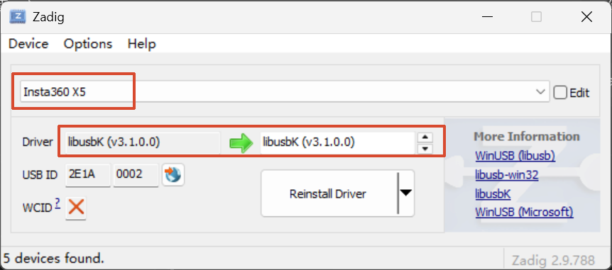

# Insta360 X5 实时全景背景 for Isaac Sim

本项目从 Insta360 X5 通过 USB 获取实时双鱼眼视频，使用 CameraSDK 与
MediaSDK 在 Windows 完成 4K 全景拼接，再通过 TCP 将 2:1 ERP 全景发送到
远端 Isaac Sim，作为无碰撞的实时环境背景显示。

当前主链路不需要 DAP、深度图或点云。

## 数据链路

```text
Insta360 X5
  -- USB / Android 模式 -->
CameraSDK 3840x1920@30
  -- 编码视频 + gyro + exposure -->
MediaSDK RealTimeStitcher
  -- 3840x1920 RGBA ERP -->
OpenCV JPEG 90
  -- PANO/TCP，172.16.23.253:5002 -->
Isaac Sim 6.0.1
  -- DynamicTextureProvider -->
无碰撞内视全景球
```

## 已验证结果

真实 X5 到远端 Isaac Sim 的持续测试结果：

```text
Panorama:          3840 x 1920
Network received:  31 frames
Texture uploaded:  30 frames
Skipped:           1 frame
Texture upload:    12.80 FPS
```

测试平台：

- Windows 端：Insta360 X5 + CameraSDK + MediaSDK + OpenCV 4.13
- 远端：NVIDIA DGX Spark / GB10 / ARM64
- Isaac Sim：6.0.1.0

## 目录结构

```text
Insta360
├─ README.md
├─ scripts
│  └─ build_camera_msvc.cmd
├─ src
│  └─ camera
│     ├─ CMakeLists.txt
│     └─ insta360_ai_stitch_preview.cpp
├─ third_party
│  ├─ isaacsim_live_panorama
│  │  ├─ README.md
│  │  ├─ isaacsim_live_panorama.py
│  │  ├─ protocol_probe.py
│  │  ├─ smoke_test.py
│  │  └─ real_camera_test.py
│  └─ DAP
└─ libs
   ├─ CameraSDK
   ├─ MediaSDK
   └─ opencv
```

`libs` 不纳入仓库，需要自行放置官方 SDK 和 OpenCV Windows 包。

## 1. Windows 准备

1. 使用 USB 连接 Insta360 X5。
2. 在相机上将 USB 模式切换为 `Android`。
3. 使用 Zadig 为相机安装 `libusbK` 驱动。
4. 确认没有其他程序占用相机。

Zadig 参考：



依赖目录应为：

```text
libs
├─ CameraSDK
│  ├─ bin
│  ├─ include
│  └─ lib
├─ MediaSDK
│  ├─ bin
│  ├─ include
│  ├─ lib
│  └─ models
└─ opencv
   └─ build
```

## 2. 构建 Windows 发送端

在仓库根目录运行：

```powershell
cd C:\code\moonbot\Insta360
.\scripts\build_camera_msvc.cmd
```

构建产物：

```text
C:\code\moonbot\Insta360\build\camera_msvc\Release\insta360_ai_stitch_preview.exe
```

## 3. 部署远端 Isaac Sim 脚本

远端目标目录：

```text
/home/nvidia/insta360_live_panorama
```

首次部署或更新时，在 Windows PowerShell 运行：

```powershell
ssh nvidia@172.16.23.253 "mkdir -p /home/nvidia/insta360_live_panorama"

scp .\third_party\isaacsim_live_panorama\*.py `
    .\third_party\isaacsim_live_panorama\README.md `
    nvidia@172.16.23.253:/home/nvidia/insta360_live_panorama/
```

不要把密码写进脚本或 README，由 SSH 提示时手动输入。

## 4. 在 Isaac Sim 中启动接收器

先打开远端 Isaac Sim 图形界面，然后进入：

```text
Window > Script Editor
```

在 **Isaac Sim Script Editor** 中执行：

```python
exec(open("/home/nvidia/insta360_live_panorama/isaacsim_live_panorama.py", encoding="utf-8").read())
```

成功日志：

```text
[Insta360 Live ...] Listening on 0.0.0.0:5002
```

重要：上面的 `exec(open(...))` 是 Python 代码，不能输入到下面这种 Bash 提示符：

```text
(base) nvidia@spark-32d2:~$
```

如果 Bash 报错：

```text
-bash: 未预期的记号 "open" 附近有语法错误
```

说明代码执行位置错误，应改到 Isaac Sim 的 Script Editor。

## 5. 启动 X5 发送端

确认 Isaac Sim 已输出 `Listening on 0.0.0.0:5002` 后，在 Windows 运行：

```powershell
cd C:\code\moonbot\Insta360
.\build\camera_msvc\Release\insta360_ai_stitch_preview.exe
```

正常流程日志：

```text
Camera: Insta360 X5, firmware: ...
CameraSDK live stream started.
MediaSDK stitcher started.
MediaSDK 已输出首个全景帧。
TCP connected to 172.16.23.253:5002.
```

远端 Isaac Sim 应输出：

```text
[Insta360 Live ...] Camera connected: ...
[Insta360 Live ...] Displayed frames=..., latest=...
```

按 `ESC` 或关闭 Windows 预览窗口可正常退出。

## 当前参数

| 参数 | 当前值 |
|---|---:|
| X5 直播分辨率 | 3840 x 1920 @ 30 |
| MediaSDK 输出 | 3840 x 1920 RGBA |
| 拼接方式 | `DYNAMICSTITCH` |
| FlowState | 开启 |
| 视频码率 | 20 Mbps |
| JPEG 质量 | 90 |
| TCP 发送上限 | 15 FPS |
| 远端地址 | 172.16.23.253:5002 |
| Isaac 动态纹理 | `dynamic://insta360_live_panorama` |
| 全景球半径 | 100 m |
| 碰撞 | 无 |

## TCP 帧协议

所有整数使用网络字节序：

```text
magic        4 bytes   "PANO"
version      uint16    1
codec        uint16    1 = JPEG
frame_id     uint64
timestamp_us uint64
width        uint32
height       uint32
payload_len  uint32
payload      bytes
```

TCP 没有消息边界，收发端分别使用 `send_all()` 和 `recv_exact()`。发送端和
Isaac 接收端都只保留最新帧，处理速度不足时丢弃旧帧，避免延迟持续累积。

## 测试工具

### 仅验证协议和真实分辨率

远端运行：

```bash
/home/nvidia/miniconda3/envs/env_isaacsim/bin/python \
  /home/nvidia/insta360_live_panorama/protocol_probe.py
```

然后启动 Windows 发送端。成功示例：

```text
PROBE_OK client=... frame=1 size=3840x1920 jpeg=...
```

探针收到一帧后会自动退出，因此发送端随后出现 `TCP connect failed` 属于正常现象。

### Isaac Sim API 烟雾测试

该测试使用生成图验证全景球、TCP、JPEG 解码和动态纹理上传：

```bash
LD_PRELOAD=/lib/aarch64-linux-gnu/libgomp.so.1 \
  /home/nvidia/miniconda3/envs/env_isaacsim/bin/python \
  /home/nvidia/insta360_live_panorama/smoke_test.py
```

成功输出：

```text
SMOKE_TEST_OK
```

### 真实 X5 持续测试

远端先运行：

```bash
LD_PRELOAD=/lib/aarch64-linux-gnu/libgomp.so.1 \
  /home/nvidia/miniconda3/envs/env_isaacsim/bin/python \
  /home/nvidia/insta360_live_panorama/real_camera_test.py
```

再启动 Windows 发送端。测试上传 30 帧后自动退出并输出实际帧率。

## 停止与重启

Windows 发送端优先使用 `ESC` 正常退出。若旧进程残留：

```powershell
Get-Process insta360_ai_stitch_preview -ErrorAction SilentlyContinue
Stop-Process -Name insta360_ai_stitch_preview -Force
```

在 Isaac Sim Script Editor 停止接收器：

```python
import builtins
builtins._insta360_live_panorama.stop()
```

重新执行主脚本会自动停止旧实例，再重新绑定端口。

## 常见问题

### 未发现相机

```text
未发现相机，请检查 USB 安卓模式和 libusbK 驱动。
```

依次检查 USB 连接、Android 模式、Zadig 驱动和旧进程占用。

### TCP connect failed

先确认 Isaac Sim Script Editor 已运行接收脚本，再从 Windows 检查：

```powershell
Test-NetConnection 172.16.23.253 -Port 5002
```

`TcpTestSucceeded` 应为 `True`。

### parse packet error 或 gyro timestamp 告警

实测这些 SDK 告警没有阻止 4K 拼接和动态纹理上传。如果画面出现明显抖动、
撕裂或跳变，再检查固件、USB 状态、SDK 版本和 FlowState；不要仅根据日志判断
链路失败。

### heartbeat timeout

优先检查相机是否被旧进程占用、USB/驱动是否稳定，以及 CameraSDK 回调中是否
加入了耗时操作。当前回调只向 MediaSDK 转交数据，JPEG 和网络发送不在回调中。

### MediaSDK 崩溃或访问冲突

构建脚本会复制运行库，并删除 MediaSDK 附带的旧版 VC Runtime。若仍异常，检查：

```powershell
Get-ChildItem .\build\camera_msvc\Release\*140*.dll
```

## 可选 DAP 链路

`third_party/DAP` 保留了早期的深度估计和 PCD 工具，但不属于当前实时背景主链路。

- DAP 默认端口：`5001`
- Isaac Sim 实时背景端口：`5002`
- 当前 Windows 发送端固定发送到 `5002`

如需恢复 DAP，需要单独修改发送目标或增加第二路发送，不能假设当前程序会同时
向两个服务广播。
